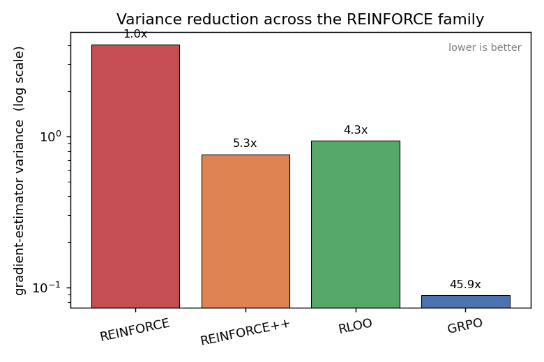
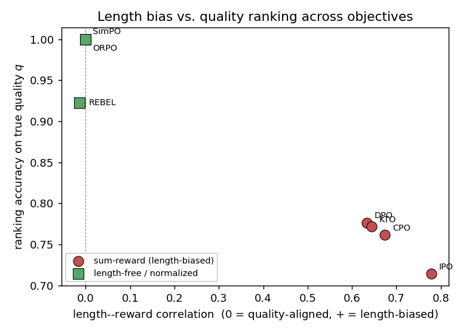
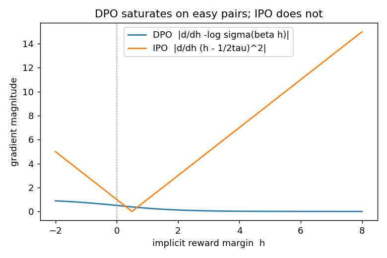
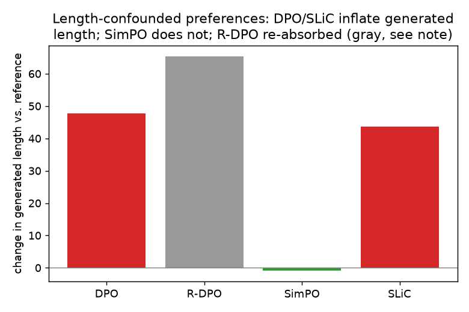
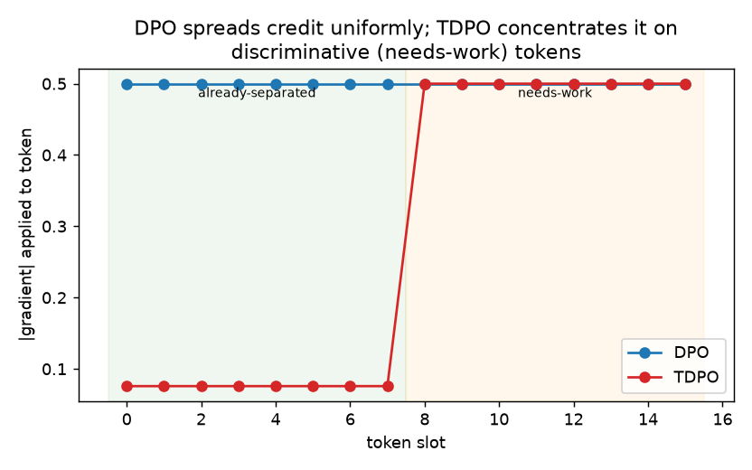
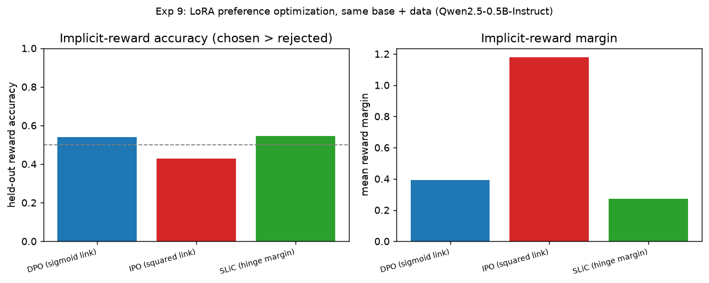

# Results

Pre-computed outputs from all nine experiments. Each experiment writes a CSV (and where applicable a PNG) to this directory. The figures and tables below are generated directly from those files — no manual editing.

---

## Experiment 1 — REINFORCE variance-reduction family

**Claim:** Baselines progressively eliminate gradient-estimator variance. Any baseline beats none by a wide margin.

| Estimator | Grad variance | Reduction vs REINFORCE |
|-----------|-------------|------------------------|
| REINFORCE | 4.0596 | 1.0× (baseline) |
| REINFORCE++ | 0.7618 | 5.3× |
| RLOO | 0.9342 | 4.3× |
| GRPO | 0.0885 | 45.9× *(z-scored; different scale)* |

REINFORCE carries the highest variance by a wide margin. REINFORCE++ (online EMA) and RLOO (leave-one-out) are comparable — their exact ordering is setup-dependent. GRPO z-scores advantages so its raw variance lives on a different scale and is not directly comparable.

---

## Experiment 2 — Controlled comparison of offline preference objectives

**Claim:** Reference-based sum-reward objectives (DPO, IPO, CPO, KTO) absorb length-confounded preference signal and develop positive length–reward correlation. Length-normalized objectives (SimPO, ORPO) and regression-based objectives (REBEL) stay quality-aligned.

| Method | Ranking accuracy (↑) | Length–reward corr (→ 0) | δ (length coef) | γ (quality coef) | Family |
|--------|---------------------|--------------------------|-----------------|------------------|--------|
| DPO | 0.776 | +0.634 | +0.269 | +0.147 | length-biased |
| IPO | 0.714 | +0.778 | +0.033 | +0.012 | length-biased |
| CPO | 0.762 | +0.674 | +0.523 | +0.257 | length-biased |
| KTO | 0.772 | +0.645 | +12.03 | +6.371 | length-biased |
| REBEL | 0.922 | −0.015 | +0.004 | +0.073 | length-robust |
| SimPO | **1.000** | −0.001 | −3.915 | +3.006 | length-robust |
| ORPO | **1.000** | −0.001 | +48.38 | +42.99 | length-robust |

SimPO and ORPO achieve perfect quality ranking because their length-normalized reward cannot express a pure-length preference — the δ coefficient is rendered irrelevant. REBEL is length-robust because it regresses onto a length-free external reward target rather than fitting a pairwise margin. DPO/IPO/CPO/KTO all develop a positive length–reward correlation, confirming the survey's length-bias claim.

---

## Experiment 3 — DPO saturation vs. IPO squared loss

**Claim:** DPO's gradient weight `σ(−β h)` vanishes as the margin `h` grows; IPO's gradient grows linearly in the margin error.

Selected values from the sweep (`β = τ = 1.0`):

| Margin h | \|dDPO/dh\| | \|dIPO/dh\| |
|---------|------------|------------|
| −2.0 | 0.8808 | 5.0000 |
| 0.0 | 0.2500 | 1.0000 |
| 2.0 | 0.0177 | 3.0000 |
| 4.0 | 0.0009 | 7.0000 |
| 8.0 | 0.0000 | 15.000 |

Once a preference pair is already well-separated (large positive h), DPO's gradient effectively disappears — easy pairs stop contributing to learning. IPO's squared loss keeps a proportional gradient throughout.

---

## Experiment 4 — Verifiable rewards: best-of-N and majority voting

**Claim:** Sampling multiple solutions and aggregating improves accuracy over a single greedy sample when a verifiable reward is available.

Model: `qwen2.5:7b` · Problems: 20 · Samples per problem: 8

| Strategy | Accuracy |
|----------|---------|
| Greedy (pass@1) | 1.000 |
| Majority@8 (self-consistency) | 1.000 |
| Best-of-8 (oracle / pass@N) | 1.000 |

All three strategies achieved 100% on this problem set, indicating that `qwen2.5:7b` handles the 20 embedded math problems reliably even with greedy decoding. The ordering best-of-N ≥ majority@N ≥ greedy is expected to become apparent on harder problem sets or weaker models.

---

## Experiment 5 — Self-rewarding / LLM-as-judge

**Claim:** A model acting as its own judge can produce useful (y_w, y_l) preference pairs without human labels.

Model: `qwen2.5:7b` · Problems: 12 · Candidates per problem (K): 4

| Metric | Value |
|--------|-------|
| Chosen-best accuracy (y_w correct) | 0.833 |
| Judge ranking agreement vs. truth | 0.333 *(on 3 mixed problems)* |

The model selected a correct solution as best 83% of the time. Judge ranking agreement is measured only on the 3 problems where the candidate pool contained at least one correct and one incorrect solution — the limited mixed-problem count makes this metric noisy. On a harder problem set with more mixed outcomes, this metric becomes more informative.

---

## Experiment 6 — CoT distillation data generation

**Claim:** Filtering teacher rationales to those that reach the correct answer yields a higher-quality distillation dataset.

Model: `qwen2.5:7b` · Problems: 15 · Traces per problem: 3

| Metric | Value |
|--------|-------|
| Total traces generated | 45 |
| Accepted traces (correct) | 45 |
| Acceptance rate | 1.000 |
| Problem coverage | 1.000 |

All 45 traces were accepted, producing a complete distillation dataset of 45 (question, rationale, answer) examples. As with Experiment 4, `qwen2.5:7b` solves these problems reliably; on harder benchmarks filtering would discard a meaningful fraction of traces, making the acceptance-rate metric the key quality signal.

Dataset written to: `exp6_cot_distillation_dataset.jsonl`

---

## Experiment 7 — Generation-time length control (R-DPO / SLiC / SimPO)

**Claim:** Under length-confounded preferences, DPO and SLiC lower the EOS probability and inflate generated length. SimPO's length normalization keeps generated length near the reference. R-DPO's penalty is re-absorbed in the unigram setting.

| Method | Mean gen length | Δ vs reference | Mean quality |
|--------|----------------|----------------|-------------|
| REFERENCE | 6.41 | — | −0.610 |
| SimPO | **5.49** | −0.93 | **+0.241** |
| DPO | 54.09 | +47.67 | −0.320 |
| SLiC | 50.02 | +43.61 | −0.568 |
| R-DPO | 71.82 | +65.41 | −0.435 |

SimPO is the only method that keeps generated length near the reference and improves quality. DPO and SLiC both lower the EOS probability dramatically, generating sequences 8–9× longer than the reference. R-DPO tracks DPO rather than correcting it — in this unigram setting the length-confound can only be expressed via the EOS probability, so R-DPO's pair-reweighting penalty is re-absorbed, confirming the documented limitation in `exp7_length_generation.py`.

---

## Experiment 8 — Token-level credit assignment: DPO vs. TDPO

**Claim:** DPO distributes gradient uniformly across all token positions. A token-factorized (TDPO-style) objective concentrates gradient mass on tokens that still need to be separated.

Setup: 8 already-separated tokens (reference logit = 2.5) + 8 needs-work tokens (reference logit = 0.0).

| Method | Grad @ separated | Grad @ needs-work | Work/sep ratio | % mass on needs-work |
|--------|-----------------|-------------------|---------------|----------------------|
| DPO | 0.5000 | 0.5000 | 1.00× | 50.0% |
| TDPO | 0.0759 | 0.5000 | **6.59×** | **86.8%** |

DPO applies an identical gradient weight to every token slot regardless of whether that slot already separates winner from loser. The TDPO-style token-factorized credit sends 87% of its gradient mass to the 8 needs-work tokens while spending almost nothing on the 8 already-separated ones.

---

## Experiment 9 — LoRA preference optimization (DPO / IPO / SLiC)

**Claim:** With base model, dataset, LoRA config, optimizer, and step budget held fixed, differences in held-out reward accuracy isolate the loss function.

Model: `Qwen/Qwen2.5-0.5B-Instruct` · Dataset: `trl-lib/ultrafeedback_binarized` · Steps: 80 · LoRA rank: 16

| Objective | Loss type | Train loss | Eval loss | Reward accuracy (↑) | Reward margin |
|-----------|-----------|-----------|-----------|---------------------|---------------|
| DPO (sigmoid link) | `sigmoid` | 0.674 | 0.674 | **0.539** | +0.392 |
| SLiC (hinge margin) | `hinge` | 0.913 | 0.873 | **0.546** | +0.273 |
| IPO (squared link) | `ipo` | 24.34 | 25.17 | 0.428 | +1.177 |

DPO and SLiC achieve comparable held-out reward accuracy (~54%) after 80 steps. IPO's reward accuracy falls below 50% despite a large reward margin — the squared loss on a raw margin scale is highly sensitive to the β and τ hyperparameters, and 80 steps at the shared learning rate may not be sufficient for it to converge. All three are Psi-PO link functions trained under identical conditions; the differences reflect loss-function behavior, not data or architecture.
